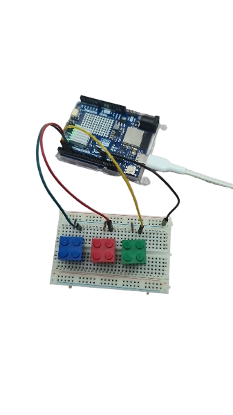

# Dread-wall: XR Digital Twin Escape Room

**Dread-wall** is an innovative XR escape room experience built with Unity 6, Meta Quest 3, Arduino R4 WiFi, and Photon Fusion. The project demonstrates Digital Twin technology by synchronizing real-world physical inputs with a virtual escape room environment.

---

## 🚀 Project Overview

- **Players:**  
  - **Player 1** (VR): Immersed in a VR escape room (Meta Quest 3), solving puzzles using virtual cubes.
  - **Player 2** (Physical): Controls the appearance of cubes in VR by pressing and holding three physical buttons (red, blue, green) connected to Arduino.

- **Digital Twin Concept:**  
  The VR environment is a 1:1 replica of the physical space. Button presses in the real world immediately trigger cube visibility in VR.

- **Multiplayer:**  
  Real-time collaboration is powered by [Photon Fusion](https://doc.photonengine.com/fusion/current/), synchronizing states across devices.

---

## 🛠️ Hardware Setup

- **1 × Arduino Uno R4 WiFi**
- **3 × Push Buttons** (Red, Blue, Green)
- **WiFi Router** (all devices must be on the same LAN)
- **PC running Unity 6**
- **Meta Quest 3** headset

---

## 🖥️ Software Setup

### Prerequisites

- Unity 6 (6000.0.40f1 LTS)
- Meta All-In-One SDK: 74.0.3
- Unity OpenXR Meta: 2.1.0
- Photon Fusion: 2.0.6
- Arduino IDE

### Arduino Installation

1. Flash the provided Arduino code (`.ino`) to the Arduino Uno R4 WiFi.
2. Ensure WiFi credentials and the correct broadcast IP (`192.168.X.255`) are set.
3. Connect buttons to pins 2, 3, and 4 (using INPUT_PULLUP).

### Unity Installation

1. Clone this repo and open in Unity 6.
2. Install all required packages via Unity Package Manager.
3. Place your cubes (`CubeA`, `CubeB`, `CubeC`) in the scene and assign them in the controller script.
4. Set up Photon Fusion for networked gameplay.

---

## ⚡ Features

- **Real-time Digital Twin**: Synchronous appearance/disappearance of cubes in VR based on physical button states.
- **Collaborative Escape Room**: Two-player teamwork under time pressure as VR walls close in.
- **Multiplayer Networking**: Robust real-time state sharing with Photon Fusion.
- **XR Immersion**: VR player navigates a virtual room that matches the real-world layout.

---

## 🔄 Usage

- **Player 2** presses and holds a colored button.  
- **Player 1** sees the corresponding cube appear in VR and must place it in the matching target before time runs out.  
- Release of a button causes the cube to disappear instantly.

---

## 🧑‍💻 Deployment

- All devices must be on the same WiFi network for UDP broadcast.
- Use the correct Unity build for Meta Quest 3 deployment.
- Configure Photon Fusion for your room/server as needed.

---

## 📚 Documentation & Links

- [Unity MainThread Dispatcher (if needed)](https://github.com/PimDeWitte/UnityMainThreadDispatcher)
- [Photon Fusion Docs](https://doc.photonengine.com/fusion/current/)
- [Meta Quest SDK Docs](https://developer.oculus.com/documentation/unity/)

---

## 🏆 Challenges

- **UDP Communication:** Ensuring reliable UDP broadcast required correct binding of the Arduino's network interface and firewall configuration on the PC.
- **Threading in Unity:** Cross-thread messaging for UDP required a thread-safe queue to update GameObjects from the main thread.
- **XR Device Compatibility:** Integrating Meta Quest 3 and XR plugins in Unity while maintaining real-time synchronization.
- **Multiplayer Sync:** Proper state synchronization across devices was achieved through Photon Fusion.
- **Real-Time Responsiveness:** Ensuring cube visibility updated instantly for immersive collaboration.

---

## 👨‍💻 Authors

- Iman Dashtpeyma
- Yonglong Chen
- Sakib Ahsan Dipto

---

## 🙏 Acknowledgments

Special thanks to our teachers:

- Charles Windlin  
- António Miguel Beleza Maciel Pinheiro Braga  
- Jordi Solsona Belenguer  

for their guidance, feedback, and support throughout this project.

---
