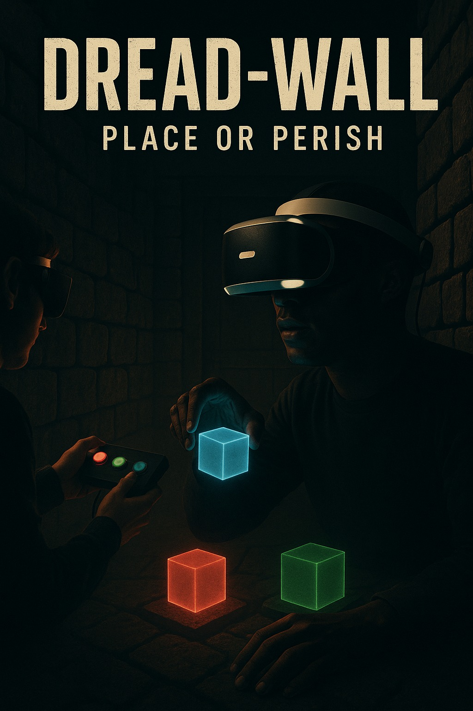
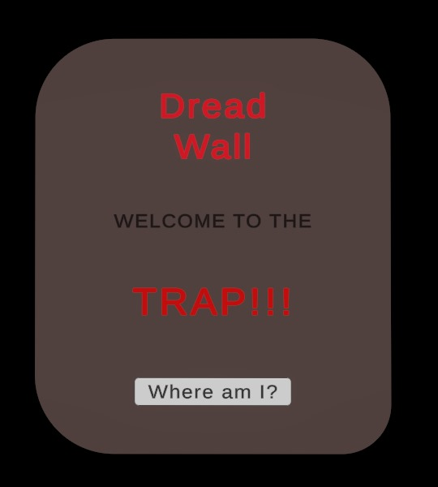
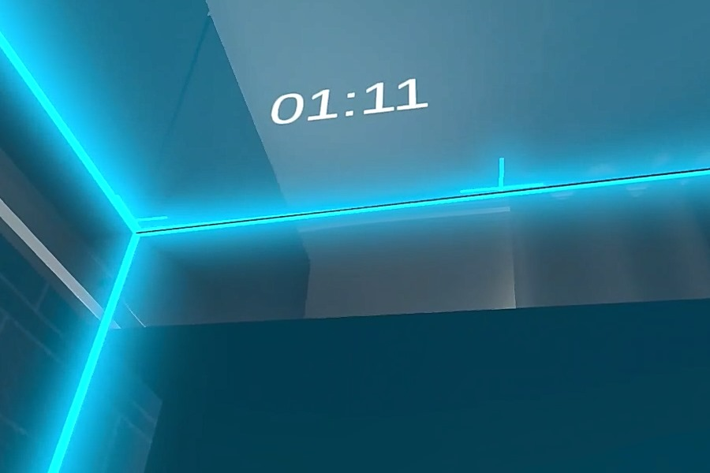
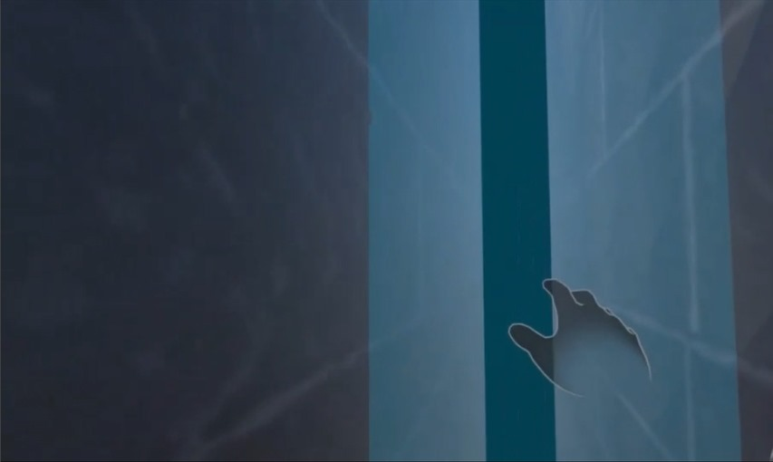

# Dread-wall: XR Digital Twin Escape Room

The Dread-Wall project is a collaborative mixed reality (MR) escape room experience designed for two players. The core idea centers around time-based puzzle solving, environmental pressure, and teamwork. One player wears a Meta Quest headset and interacts with the virtual environment, while the other player in the co-located virtual environment assists physically by using an Arduino-based button system that triggers puzzle elements. 

This project aims to explore embodied interaction and spatial collaboration. It offers educational value in the domains of MR design, spatial UI, interaction modeling, and real-world embedded communication between digital twins and physical props. It also teaches design iteration, hardware-software integration, and immersive player experience tuning.

---

## Design Process

We began with the intent to design an MR experience that highlights collaboration, urgency, and tactile engagement. The project followed an iterative design process, evolving from a broad multi-puzzle escape room concept into a refined short-timed challenge.

## Initial Goals:

- Create an immersive, short-duration MR game with time pressure. 

- Enable real-world interaction to influence MR feedback. 

- Foster cooperation between physically-present players to incorporate digital twin experience.

  

## Challenges And How We Adapted:

- Arduino-to-Unity communication: Resolved using WiFi communication over serial, triggering in-game object spawning. We used Arduino R4 in this case.

- No headset at home: XR Simulator was used extensively, and prefab scaling was adapted to feel correct during final deployment.

- Destroying walls: We tried moving walls first as for the final escape for the player, which was unreliable in MR and XR simulator, and later switched to destroying walls using material transparency which was a simpler and more effective solution.

---

## Design Decisions And Interaction Justifications

We deliberately chose interactions and feedback mechanisms that supported immersion, usability, and hardware feasibility within our limited timeframe and resources. Below is a breakdown of our key interaction decisions and why each was preferred over alternatives:

- ## Hand Tracking With HandGrab Interactions

We used Meta's built-in HandGrab interactions because they offer more stability and intuitive use in MR than gesture-based systems. Gesture recognition (like custom hand signs) was considered but discarded due to its inconsistency, higher learning curve, and limited debugging visibility.

- ## Color Matching Mechanics

The decision to use simple RGB-based color matching was rooted in visual clarity and rapid player understanding. Complex spatial puzzles or symbol-based logic were ruled out to keep the experience short, intuitive, and language-independent.

- ## Sound Feedback

Audio was added to reinforce puzzle state changes (e.g., cube placement, win/loss). We opted for short, distinct sound cues over longer narration to avoid distraction during timed gameplay.

- ## Destroying Walls Instead Of Moving Walls

Initially, moving walls were used to simulate pressure, but physics inconsistencies and MR occlusion issues led us to switch to fading. It created the same emotional effect while being much smoother visually and more technically reliable.

- ## Countdown Pressure Via Vignette Shrink And Timer

Instead of a simple countdown text, we used visual tunnel vision (vignette) to simulate spatial shrinking. This added immersive tension without confusing the player, as it physically represented time running out.

---

## Features And Functionalities

- Two-player experience (both present in real-world space). 

- Player 2 uses an Arduino device to send button presses corresponding to colored puzzle cubes.

- Player 1, using the Meta Quest headset, sees the generated puzzle pieces and color-coded target panels over time.

- Player 1 must grab and match the cubes to the correct target pads. 

- Game includes a 60-second timer shown via UI or vignette compression. 

- On success, a visual and audio cue plays, and a wall is destroyed as to reveal the escape zone for the player.

- On failure, player receives a message and walls keep shrinking to create the immersion of the player being squeezed in the world.

---

## Installation Process

To build and run the Dread-Wall project:

## Requirements:

- Unity 6 or above 
- Meta XR Plugin + XR Interaction Toolkit
- Meta Quest 3 headset (for full testing) / Or similar kind 
- Arduino Uno with WiFi module (e.g., ESP8266), Preferably Arduino R4.

## Unity Setup:

1. Clone the repository. 
2. Open in Unity 6. 
3. Go to Package Manager, install Meta XR SDK**(v74.0.3)**, XR Interaction Toolkit. 
4. Switch platform to Android. 
5. Enable OpenXR under XR Plug-in Management. 
6. Add scene (MainScene) to Build Settings. 
7. Build & Run with Meta Quest headset connected.

## Arduino Setup:

- Attach 3 push buttons wired to GPIO pins. 
- Send WiFi messages to Unity. 
- Use Unity's UDP Listener or MQTT for message reception.

## Unity Dependencies:

- Input System - Meta SDK and Building Blocks (HandGrab, Poke, Spawnable Objects) - Shader Graph for Material Transparency This step-by-step installation allows complete project reproducibility by any Unity user with headset access.

---

## Usage  

1. Player 1 wears headset and presses in-game activator button.  

   

2. Player 2 presses a color-coded button (Red, Green, Blue).  

   

3. The timer appears on top of the player.  

   

4. Corresponding color puzzle block spawns in MR.  

5. Player 1 grabs the virtual piece using HandGrab interaction and places it on its  matching color pad.  

6. Repeat for all 3 pieces.  

7. If completed within 60 seconds, wall gets destroyed and exit audio is played.  

8. If failed, walls keep squeezing to the player with subtle failure cue.

   

## Best practices to experience Dread-Wall:  

- Make sure players are in the same physical room.  
- Arduino and WiFi must be on same network as the Unity build. Preferably a  strong network with higher bandwidth.  
- Use debug logs during development for input verification. 

---

## References

- ***The Room VR: A Dark Matter*** - for narrative-driven MR pacing.

- ***Keep Talking and Nobody Explodes*** - inspired our two-player cooperative format.

- ***Meta Building Blocks Samples*** - used as base prefabs for hand interactions.

- ***Cryptic Cabinet*** - guided our visual tension-building approach.

---

## Contributors

Sakib Ahsan Dipto (sakibahsandipto@gmail.com) 

Yonglong Chen (cats1821086364@gmail.com) 

Iman Dashtpeyma (iman.dashtpeyma@gmail.com)

---
